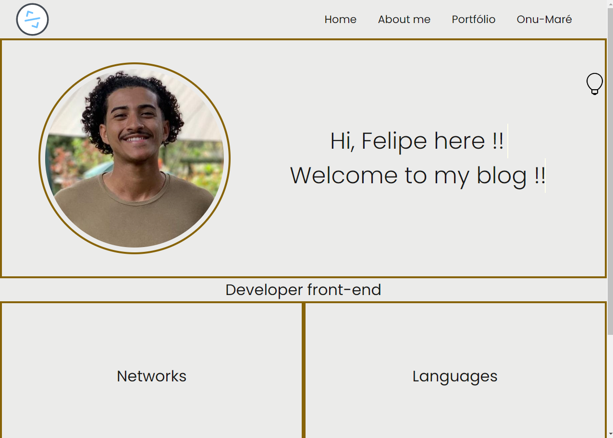

<h1 align="center">Meu blog Pessoal</h1>

  <a href="#-tecnologias">Tecnologias</a>&nbsp;&nbsp;&nbsp;|&nbsp;&nbsp;&nbsp;
  <a href="#-projeto">Projeto</a>&nbsp;&nbsp;&nbsp;|&nbsp;&nbsp;&nbsp;

 

  

## 🚀 Tecnologias

Esse projeto foi desenvolvido com as seguintes tecnologias:

- ReactJS
- Styled-components
- typeScript
- Git e Github

## 💻 Projeto

O projeto final proposto pelo vai na web, teve como objetivo que os seus alunos fizessem um blog pessoal contendo as suas informações de contato , seus repositorios.

